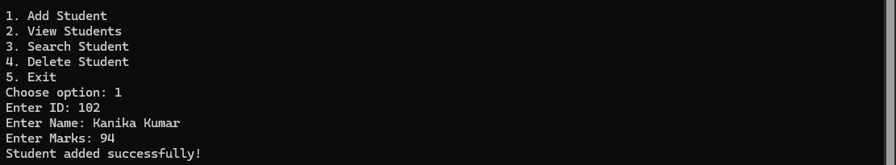
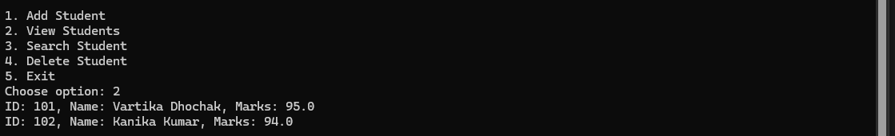

# Student Management System (Java)

A console-based Java application that allows users to manage student records efficiently.

---

## Features

- Add Student
- View All Students
- Search Student by ID
- Delete Student
- Menu-driven interactive system

---

## Technologies Used

- Java
- OOP Concepts (Classes & Objects)
- ArrayList
- Scanner (User Input Handling)

---

## How to Run

1. Compile the program:
2. Run the program:
## Sample Output

### 🔹 Adding Students

### 🔹 Viewing Students

### 🔹 Searching Student

### 🔹 Deleting Student

---

## Concepts Demonstrated

- Object-Oriented Programming
- Dynamic Data Storage using ArrayList
- Conditional Logic
- Looping Structures
- String Handling
- User Input Validation

---

## Future Improvements

- Add file storage (data persistence)
- Add update student feature
- Add GUI version
- Connect with database (MySQL)

